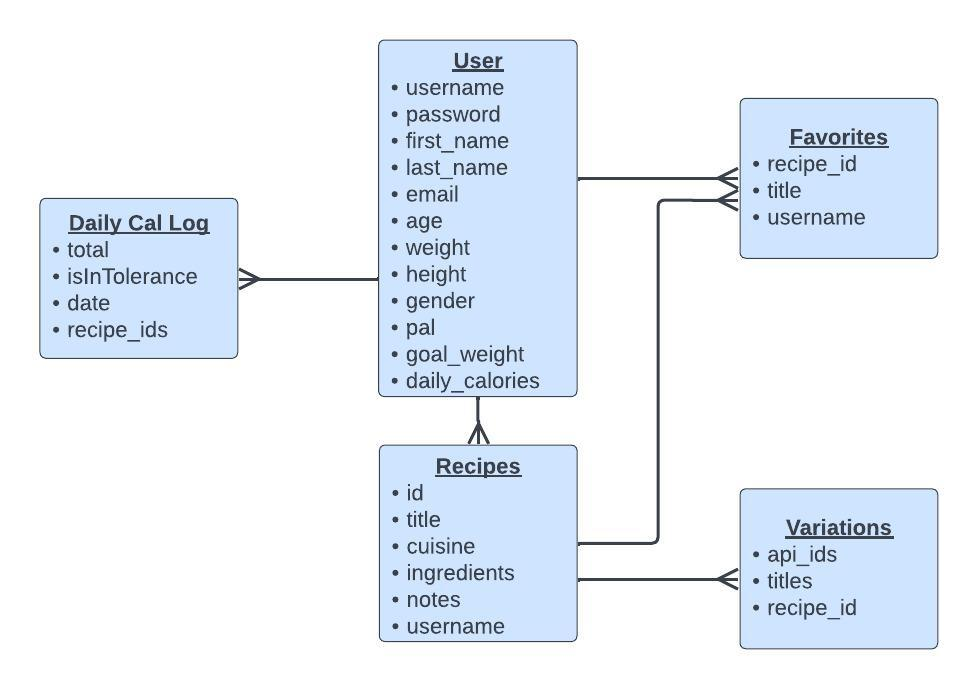

# Capstone-2

1. Tech Stack:
   - The tech stack for this project will include Node, React, and CSS.
2. Project focus, website or mobile app:
   - This app will be mostly a front-end web application.
3. Project design goal:
   - The goal for this project is for the user to be able to Create, Search, Favorite, and Log daily calories of all your favorite meals! Users may have already have certain ingredients at home and need a recipe to use them up before they go bad. The app can search by cuisine or by ingredients to find alternative recipes (Spoonacular API) and will return recipes based on what they submitted and provide a list of ingredients they may still need to buy.  
   - Users can also keep track of their daily calorie intake but logging the recipes they eat throughout the day. The app will also determine their optimum calorie intake based on their BMI and their goals to either lose, maintain, or gain weight.
4. User Demographics:
   - The user demographic will be anyone that enjoys cooking and does not like to let groceries go to waste.
5. Data:
   - The app will use the Spoonacular API, which will allow users to search recipes by ingredients or by cuisine.
6. Database Schema:
   - Users: username, password, first name, last name, email, age, weight, height, gender, physical activity level, weight goals.
   - Recipes: title, cuisine, ingredients, instructions, avg calories, notes.
   - Favorites: title, recipeId
   
7. Potential issues:
   - An issue that I may encounter is exceeding the daily quota for returned API endpoints. When your daily quota is used up, the API will respond with the error code 402 and no more calls can be made until your quota resets. The limit is determined by which plan you purchase. 
8. Any sensitive information:
   - Sensitive information will include email, passwords, BMI info. Passwords will be hashed using Bcrypt. User permission will be required to view user BMI information.
9. User Flow: 
   - Create recipes.
   - Search for recipes by cuisine.
   - Search for recipes by ingredients.
   - Favorite/Unfavorite recipes.
   - Log daily calories.
10. Stretch goals:
   - Button to show the user if they have made that recipe before or not.
   - Add ingredients shopping list.
