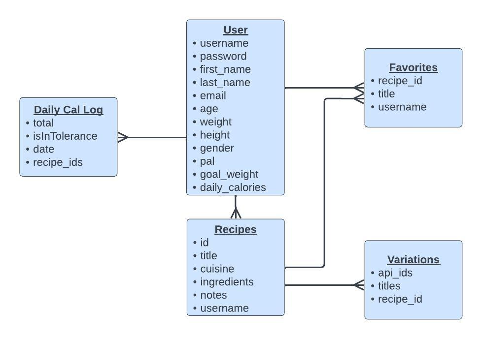

## Capstone-2
# My Kitchen App

App Link: https://my-kitchen-frontend.onrender.com

Backend Code: https://github.com/vrbrag/Capstone2-backend

Tech Stack: ReactJS, Node.js, JavaScript, Express, HTML, CSS, Reactstrap, and Jest.
     

Project design goal:
   - For users to be able to Create, Search, Favorite, and Log daily calories of all your favorite meals! Users may have already have certain ingredients at home and need a recipe to use them up before they go bad. The app can search by cuisine or by ingredients to find alternative recipes (Spoonacular API) and will return recipes based on what they submitted.  
   - Users can also keep track of their daily calorie intake but logging the recipes they eat throughout the day. The app will also determine their optimum calorie intake based on their BMI and their goals to either lose, maintain, or gain weight.

User Demographics:
   - The user demographic will be anyone that enjoys cooking and prefers to have a digital cookbook, and wants to keep track of their daily meals and calories.

Data:
   - The app will use the Spoonacular API, which will allow users to search recipes by ingredients or by cuisine.

Database Schema:
   - Users: username, password, first name, last name, email, age, weight, height, gender, physical activity level, weight goals.
   - Recipes: title, cuisine, ingredients, instructions, avg calories, notes.
   - Favorites: title, recipeId
   
 

Any sensitive information:
   - Sensitive information will include email, passwords, BMI info. Passwords will be hashed using Bcrypt. User permission will be required to view user BMI information.

User Flow: 
   - Register/Login
   - Create recipes.
   - Search all recipes.
   - Search for recipes by title.
   - Search for recipes by cuisine.
   - Search for recipes by ingredients.
   - Discover similar recipes (retreice data from Spoonacular API)
   - Favorite/Unfavorite recipes.
   - Log daily calories.

